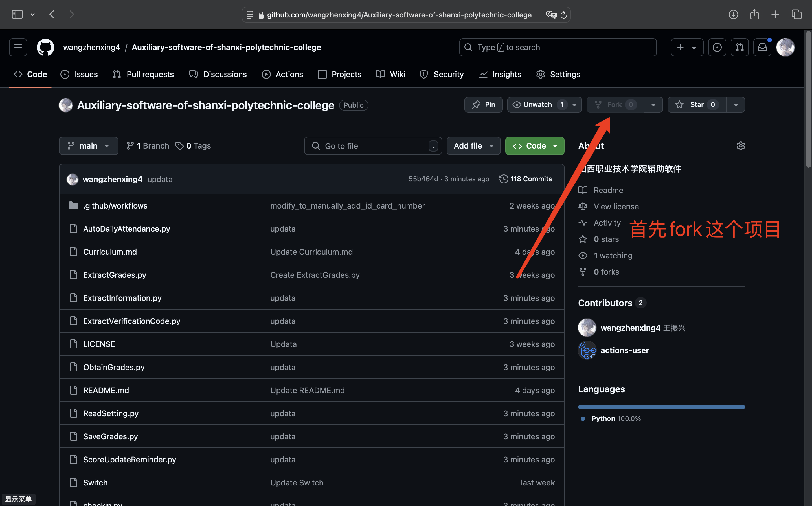
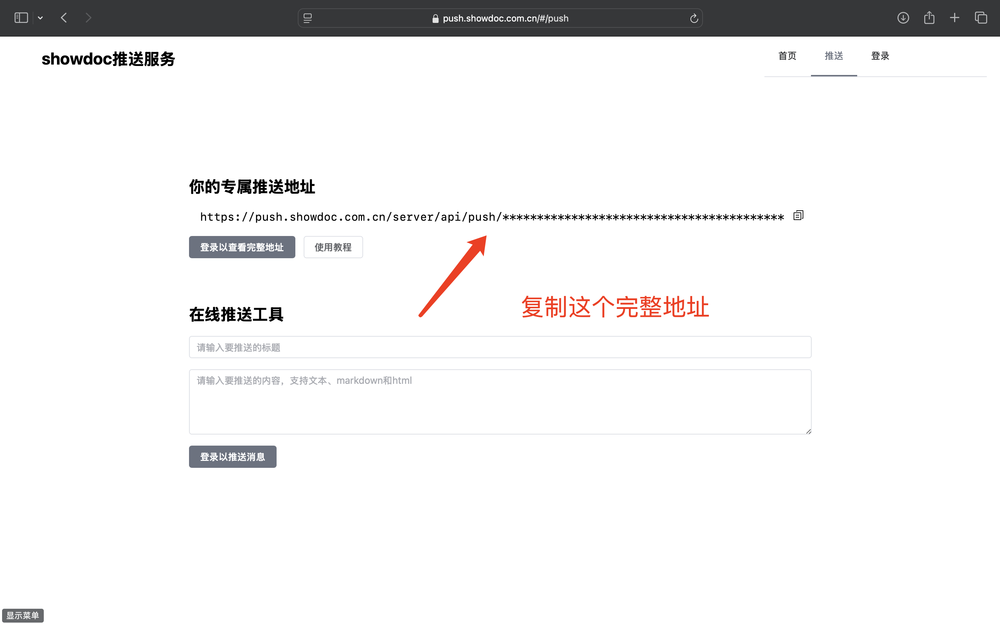
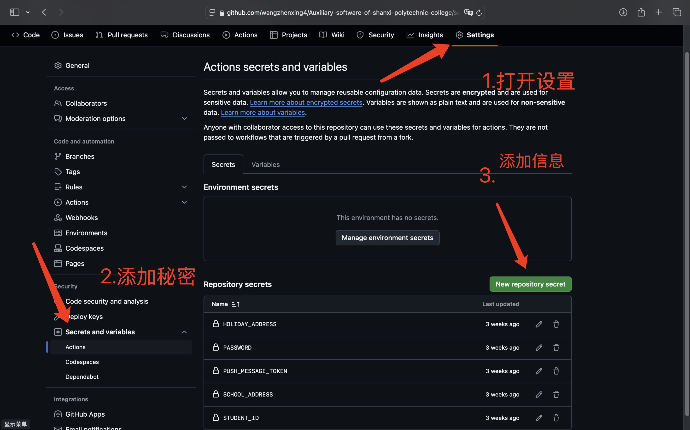

# <a href="https://github.com/wangzhenxing4/Auxiliary-software-of-shanxi-polytechnic-college">山西职业技术学院辅助软件</a>

欢迎来到山西职业技术学院！本项目致力于为同学们提供便捷的辅助功能，让你能够省去繁琐的功能，节省宝贵的时间，提升个人效率。通过这个项目，你可以利用现代技术手段，实现辅助功能。

无论你是想学习还是如何利用编程辅助自己解决实际问题，还是简单地希望减少每天的重复操作，这个项目都能为你提供一个很好的学习和实践机会。希望你能享受带来的便利，并在此基础上探索更多有趣的应用！

## 项目地址
<a href="https://github.com/wangzhenxing4/Auxiliary-software-of-shanxi-polytechnic-college">山西职业技术学院辅助软件</a>

## 功能介绍

- **自动打卡**：自动完成每日打卡
- **成绩推送**：通过微信通知用户成绩（RC1.0）
- **自动抢课**：自动完成抢课（Beta1.0）
- **<a href="https://github.com/wangzhenxing4/Auxiliary-software-of-shanxi-polytechnic-college/blob/main/Curriculum.md">获取课表</a>**：通过用户的共享推送（Alpha1.0）

## 使用方法
### 必要步骤
打开<a href="https://github.com/wangzhenxing4/Auxiliary-software-of-shanxi-polytechnic-college">山西职业技术学院辅助软件</a>
  - 你首先需要**Fork**这个项目 
  
### 自动打卡使用方法
  1.点击并关注<a href="https://push.showdoc.com.cn/">**showdoc推送服务</a>获取你的推送服务的API** 
  
  2.前往你Fork项目中的**Settings**中的**Secrets and variables**中的**Actions**，并点击**New repository secret** 
  
  3.添加以下内容
  - （1）添加ID，内容是你的身份证号码
  - （2）添加SCHOOL_ADDRESS，内容为学校地址 
  参考学校地址： 
    迎泽区山西职业技术学院(长风校区) 
    榆次区山西职业技术学院(南校区) 
    高新科技产业区山西职业技术学院(南中环校区) 
    小店区坞城路山西职业技术学院(坞城校区) 
  - （5）添加HOLIDAY_ADDRESS，内容为放假地址 
  参考地址： 
    XX县(区)XX小区 
  - （6）填写PUSH_MESSAGE_TOKEN，内容是你的完整的专属推送地址

  4.在Switch中开启/关闭：填写开启或关闭，用来控制运行是否启动
### 成绩自动更新提醒
  1.点击并关注<a href="https://push.showdoc.com.cn/">**showdoc推送服务</a>获取你的推送服务的API** 
  
  2.前往你Fork项目中的**Settings**中的**Secrets and variables**中的**Actions**，并点击**New repository secret** 
  
  3.添加以下内容
  - （1）添加STUDENT_ID，内容为你的学号
  - （2）添加PASSWORD，内容是你教务系统的登录密码（务必填写正确） 
  - （3）填写PUSH_MESSAGE_TOKEN，内容是你的完整的专属推送地址
  4.在Switch中开启/关闭：填写开启或关闭，用来控制运行是否启动
### 运行自动抢课
**自动抢课原则上需要实时性快速触发，目前极不稳定 **
  1.前往你Fork项目中的**Settings**中的**Secrets and variables**中的**Actions**，并点击**New repository secret** 
  
  2.添加一下内容，必须严格遵守代码规范，以及，正确的学号、密码
  - （1）student_id：学号
  - （2）password：密码
  - （3）course_id：第一个想抢课的顺序
  - （4）course_id2:第二个想抢课的顺序（正常使用无需添加，正在Alpha测试）

### 运行
  #### 手动运行（用于配置调试）
  - 在Actions中找到你的Workflows并运行Run Workflow即可手动运行
  #### 自动运行
  - Auto Daily Attendance自动每日00:00运行
  - Score Update Reminder自动每半小时运行
  - Automatic Course Grabbing未设置自动运行
## 特别感谢
  ### 特别感谢：<a href="https://github.com/deijing">初沐</a>提供的技术支持，同时也感谢GitHub、Python、requests库、ddddocr库、rsa库、bs4库、functools库、Regable软件、Charles软件、JetBrains提供的软件与技术支持
  ### 项目源代码
  **<a href="https://github.com/wangzhenxing4/AutoDailyAttendance">山西职业技术学院自动每日打卡任务</a>** 的自动完成打卡源代码
   
  **<a href="https://github.com/wangzhenxing4/ScoreUpdateReminder">山西职业技术学院成绩更新自动推送</a>** 的获取成绩更新源代码
   
  **<a href="https://github.com/wangzhenxing4/AutomaticCourseGrabbing">山西职业技术学院自动完成抢选修课</a>** 的自动抢选修课源代码

## 其他问题
  - 如果在使用过程中遇到任何问题或有其他建议，欢迎随时<a href="http://wangzhenxing4.github.io">联系我</a>，我将竭诚为你提供支持和帮助。祝愿你在山西职业技术学院的学习生活中一切顺利！
## 版权许可
  - 当前项目受到Creative Commons Attribution-NonCommercial-ShareAlike 4.0 International版权保护

<a property="dct:title" rel="cc:attributionURL" href="https://github.com/wangzhenxing4/Auxiliary-software-of-shanxi-polytechnic-college">Auxiliary software of shanxi polytechnic college</a> by <a rel="cc:attributionURL dct:creator" property="cc:attributionName" href="http://wangzhenxing4.github.io">王振兴</a> is licensed under <a href="https://creativecommons.org/licenses/by-nc-sa/4.0/?ref=chooser-v1" target="_blank" rel="license noopener noreferrer" style="display:inline-block;">Creative Commons Attribution-NonCommercial-ShareAlike 4.0 International</a>

